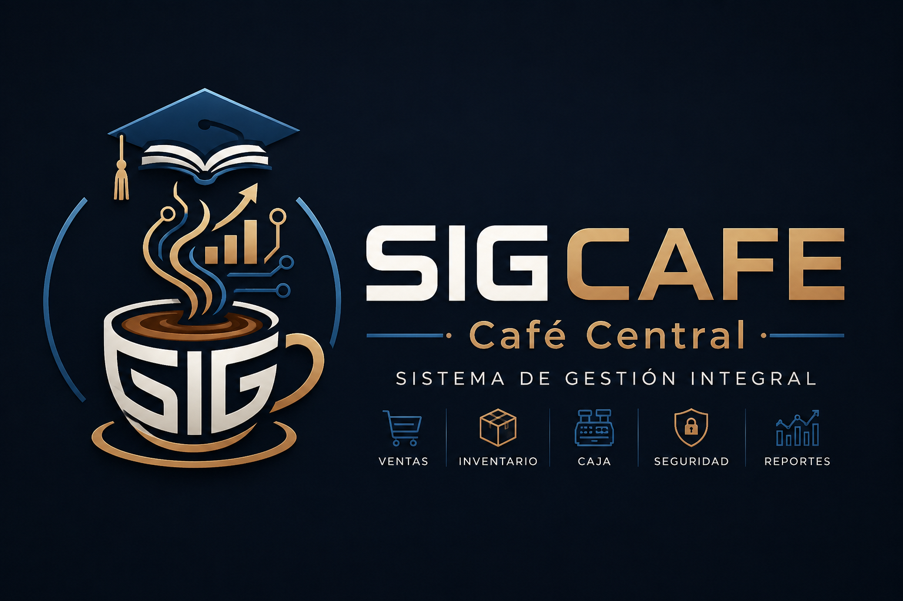
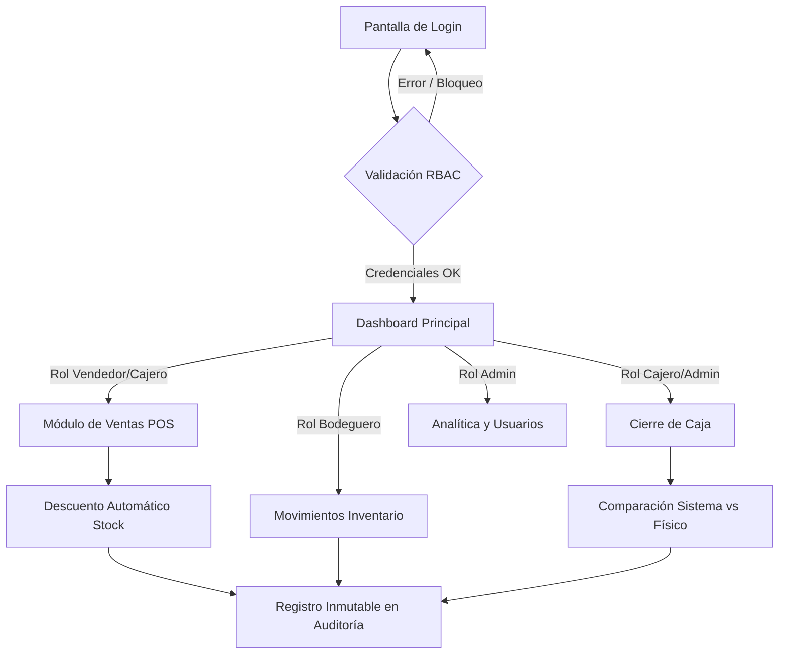

<div align="center">
  
</div>

# SIGCAFE — Sistema de Gestión Integral Café Central


> Plataforma web robusta y segura para el control integral de ventas, inventario, usuarios, caja y auditoría diseñada específicamente para la cafetería universitaria "Café Central".

---

## 📑 Tabla de Contenidos
- [Descripción General](#-descripción-general)
- [Características Principales](#-características-principales)
- [Tecnologías Utilizadas](#-tecnologías-utilizadas)
- [Arquitectura del Proyecto](#-arquitectura-del-proyecto)
- [Módulos del Sistema](#-módulos-del-sistema)
- [Roles y Permisos](#-roles-y-permisos)
- [Requisitos Previos](#-requisitos-previos)
- [Instalación y Uso](#-instalación-y-uso)
- [Credenciales de Prueba](#-credenciales-de-prueba)
- [Variables de Entorno](#-variables-de-entorno)
- [Seguridad Implementada (DevSecOps)](#-seguridad-implementada)
- [Flujo del Sistema](#-flujo-del-sistema)
- [Capturas de Pantalla](#-capturas-de-pantalla)
- [Estructura de Base de Datos](#-estructura-de-base-de-datos)
- [Comandos Útiles de Docker](#-comandos-útiles-de-docker)
- [Pruebas Funcionales](#-pruebas)
- [Contribución](#-contribución)
- [Licencia](#-licencia)

---

## 📖 Descripción General

**SIGCAFE** es un sistema web moderno diseñado para resolver los desafíos operativos y logísticos de la cafetería universitaria "Café Central". 

**Problema que resuelve:**
Históricamente, la cafetería manejaba su inventario, ventas y cierres de caja a través de libretas manuales, hojas de cálculo en Excel y mensajes de WhatsApp. Este modelo provocaba pérdidas de inventario, descuadres de caja diarios, falta de trazabilidad en operaciones sensibles y ventas no registradas.

**Solución Tecnológica:**
SIGCAFE centraliza todas las operaciones en una única plataforma digital blindada bajo estándares DevSecOps. Automatiza el cruce entre el inventario y las ventas, controla los permisos a través de 5 perfiles de acceso distintos y mantiene un registro inmutable (Auditoría) de cada acción realizada dentro de las instalaciones.

---

## ✨ Características Principales

✅ **Registro de ventas en tiempo real** con generación automática de número de transacción único UUID.  
✅ **Control de caja** con conciliación automática al cierre del día (cálculo de sobrantes/faltantes).  
✅ **Gestión de inventario** con alertas visuales de stock bajo y control estricto de fechas de vencimiento.  
✅ **Sistema de roles diferenciados** con protección y bloqueo estricto de acceso por ruta.  
✅ **Aplicación automática de promociones y combos** basados en la hora del sistema.  
✅ **Auditoría inmutable** de todas las operaciones críticas (read-only por diseño).  
✅ **Seguridad de grado empresarial:** Protección contra inyecciones SQL, XSS, CSRF, Clickjacking y fuerza bruta.  
✅ **Despliegue ultra-rápido** mediante un solo comando de Docker con base de datos persistente.  

---

## 🛠️ Tecnologías Utilizadas

| Tecnología | Versión | Uso Principal |
| :--- | :---: | :--- |
| **Python** | 3.11 | Lenguaje base del backend y lógica de negocio. |
| **Flask** | 3.0.3 | Framework web principal del sistema. |
| **SQLAlchemy** | 2.0.30 | ORM para interactuar de forma segura con la base de datos. |
| **SQLite** | 3 | Base de datos relacional embebida (configurada en modo WAL). |
| **Flask-Login** | 0.6.3 | Gestión de sesiones de usuario y autenticación. |
| **Flask-WTF / WTForms** | 1.2.1 / 3.1.2 | Renderización y validación server-side (anti-CSRF). |
| **Flask-Talisman** | 1.1.0 | Inyección de cabeceras de seguridad HTTP (CSP, HSTS). |
| **Flask-Limiter** | 3.5.0 | Rate limiting para protección contra fuerza bruta y DDoS. |
| **Werkzeug** | 3.0.3 | Funciones de hashing y seguridad criptográfica (pbkdf2:sha256). |
| **Bootstrap** | 5.3.2 | Framework frontend para UI responsive y moderna. |
| **Jinja2** | - | Motor de plantillas HTML con auto-escaping contra XSS. |
| **bleach** | 6.1.0 | Sanitización de inputs de texto libre. |
| **Docker / Compose** | - | Contenedorización, orquestación y despliegue del entorno. |

---

## 📂 Arquitectura del Proyecto

```text
sigcafe/
├── app/                      # Lógica principal del framework Flask
│   ├── auditoria/            # Módulo de log inmutable de operaciones
│   ├── auth/                 # Módulo de autenticación (Login/Logout)
│   ├── caja/                 # Módulo de conciliación y cierre diario
│   ├── dashboard/            # Pantalla principal con KPIs y métricas
│   ├── inventario/           # Movimientos de stock y alertas
│   ├── productos/            # CRUD del catálogo de productos e insumos
│   ├── promociones/          # CRUD de descuentos por horario y combos
│   ├── reportes/             # Analytics financieros y filtros de ventas
│   ├── usuarios/             # Módulo de administración de accesos
│   ├── templates/            # Plantillas HTML (Jinja2) estructuradas por módulo
│   ├── __init__.py           # App Factory, configuración y registro de Blueprints
│   ├── config.py             # Configuración general y de seguridad de la app
│   ├── decorators.py         # Decoradores customizados (RBAC y Ownership)
│   ├── extensions.py         # Instancias de librerías de terceros (Limiter, DB, etc)
│   ├── forms.py              # Validación de datos (WTForms) y sanitización
│   ├── models.py             # Modelos de base de datos SQLAlchemy
│   └── utils.py              # Funciones auxiliares (ej. Registro de Auditoría)
├── data/                     # Volumen persistente para SQLite (se crea en runtime)
├── logs/                     # Volumen persistente para logs rotativos de seguridad
├── .env.example              # Plantilla de variables de entorno (público)
├── .gitignore                # Reglas de exclusión para Git
├── backup_db.sh              # Script automatizado de backup diario de la base de datos
├── docker-compose.yml        # Orquestación de servicios y volúmenes
├── Dockerfile                # Receta de construcción de la imagen (Non-root user)
├── requirements.txt          # Dependencias y versiones exactas (Pinning)
├── run.py                    # Punto de entrada de la aplicación y auto-seed
└── seed.py                   # Script de poblamiento inicial de la base de datos
```

---

## 🧩 Módulos del Sistema

| Módulo | Descripción |
| :--- | :--- |
| 🔐 **Autenticación** | Gestión de acceso seguro, bloqueo por reintentos y protección contra session fixation. |
| 👥 **Usuarios** | CRUD de cuentas de usuario con roles de acceso (Administración y Recursos Humanos). |
| 📦 **Productos** | Gestión del catálogo, precios, categorías y control de caducidad. |
| 🛒 **Ventas** | Punto de venta dinámico (POS) con cálculo de totales, métodos de pago y descarga de inventario automática. |
| 💰 **Caja** | Monitoreo en tiempo real de ingresos diarios y ejecución del cuadre/cierre de caja. |
| 🏪 **Inventario** | Visor de existencias y registro manual de ingresos, mermas o gastos en cocina. |
| 🎯 **Promociones** | Configurador de reglas de negocio para aplicar descuentos temporales. |
| 📊 **Reportes** | Motor de analítica con filtrado por fechas (Top productos, ventas por usuario, resúmenes). |
| 📋 **Auditoría** | Bitácora de lectura exclusiva que registra el `quién`, `cuándo`, `dónde` y `qué` de cada acción crítica. |

---

## 🛡️ Roles y Permisos

| Módulo | Administrador | Cajero | Vendedor | Cocina | Bodeguero |
| :--- | :---: | :---: | :---: | :---: | :---: |
| **Ventas** | ✅ | ✅ | ✅ | ❌ | ❌ |
| **Caja** | ✅ | ✅ | 👁️ (Solo las suyas) | ❌ | ❌ |
| **Inventario** | ✅ | 👁️ | 👁️ | ✅ (Solo salidas) | ✅ |
| **Productos** | ✅ | 👁️ | 👁️ | 👁️ | ✅ |
| **Usuarios** | ✅ | ❌ | ❌ | ❌ | ❌ |
| **Promociones**| ✅ | 👁️ | 👁️ | ❌ | ❌ |
| **Reportes** | ✅ | ✅ | ❌ | ❌ | ❌ |
| **Auditoría** | 👁️ | ❌ | ❌ | ❌ | ❌ |

> 💡 **Nota:** El símbolo 👁️ indica permisos de solo lectura (View) para recursos permitidos.

---

## 💻 Requisitos Previos

Antes de instalar SIGCAFE, asegúrate de tener en tu sistema:
1. **Docker Desktop** instalado ([Descargar aquí](https://www.docker.com/products/docker-desktop/)).
2. Herramienta `docker-compose` instalada (generalmente viene con Docker Desktop).
3. **Git** para clonar el código fuente.
4. El puerto `5000` de tu máquina debe estar disponible.

---

## 🚀 Instalación y Uso

Sigue estos pasos para levantar el proyecto en tu entorno local:

**Paso 1: Clonar el repositorio**
```bash
git clone https://github.com/tuusuario/sigcafe.git
cd sigcafe
```

**Paso 2: Crear el archivo de variables de entorno**
```bash
cp .env.example .env
```
*(Abre el archivo `.env` en tu editor y define una cadena segura para `SECRET_KEY` utilizando por ejemplo `openssl rand -hex 32`)*

**Paso 3: Construir y levantar el contenedor con Docker**
```bash
docker-compose up --build
```
*(La primera vez, el sistema creará automáticamente la base de datos local y ejecutará el script `seed.py` para poblarla).*

**Paso 4: Acceder al sistema**  
Abre tu navegador web e ingresa a:
👉 [http://localhost:5000](http://localhost:5000)

**Paso 5: Detener el sistema**
```bash
docker-compose down
```

---

## 🔑 Credenciales de Prueba

Al iniciar el sistema por primera vez, utiliza cualquiera de estos usuarios pre-configurados:

| Usuario | Contraseña | Rol | Acceso |
| :--- | :--- | :--- | :--- |
| `admin@cafeteria.com` | `admin123M@` | Administrador | Acceso total |
| `cajero1@cafeteria.com` | `cajero123C@` | Cajero | Caja, Ventas y Reportes |
| `vendedor1@cafeteria.com` | `vendedor123V@` | Vendedor | Registro de Ventas |
| `cocina1@cafeteria.com` | `cocina123K@` | Cocina | Consultas y salidas de stock |
| `bodeguero1@cafeteria.com` | `bodega123B@` | Bodeguero | Gestión de Catálogo e Inventario |

> ⚠️ **Advertencia:** Estas credenciales están diseñadas exclusivamente para desarrollo y pruebas. **Deben** ser modificadas inmediatamente tras un despliegue en producción.

---

## ⚙️ Variables de Entorno

| Variable | Descripción | Valor por Defecto | Requerida |
| :--- | :--- | :---: | :---: |
| `SECRET_KEY` | Semilla criptográfica del sistema | — | ✅ Sí |
| `DATABASE_URL` | String de conexión a Base de Datos | `sqlite:////app/data/sigcafe.db` | ✅ Sí |
| `FLASK_ENV` | Entorno de ejecución (`development`/`production`) | `production` | ✅ Sí |
| `ADMIN_EMAIL` | Email administrativo de contacto | `admin@cafcentral.edu` | ❌ No |
| `MAX_LOGIN_ATTEMPTS` | Intentos de login fallidos permitidos | `5` | ❌ No |
| `LOCKOUT_MINUTES` | Duración del bloqueo tras ataques de fuerza bruta | `15` | ❌ No |
| `SESSION_MINUTES` | Tiempo inactivo máximo para cierre de sesión | `30` | ❌ No |

---

## 🔒 Seguridad Implementada (DevSecOps)

El núcleo de SIGCAFE está diseñado con un enfoque "Security by Design". Cuenta con las siguientes capas de protección:

- 🔒 **Algoritmo Robusto:** Contraseñas hasheadas en base de datos utilizando `pbkdf2:sha256` con un salt length de 16.
- 🔒 **Anti-CSRF:** Integración completa de `Flask-WTF` requiriendo tokens validados en el 100% de los formularios de estado y peticiones POST/DELETE.
- 🔒 **Anti-XSS:** Todas las plantillas emplean auto-escaping mediante `Jinja2`, los inputs largos son sanitizados con la librería `bleach`, y el motor despliega políticas `Content-Security-Policy` restrictivas.
- 🔒 **Protección Fuerza Bruta:** Limitación estricta de tasa (Rate Limiting) con `Flask-Limiter` configurado a 5 intentos por minuto en el login, seguido de bloqueo temporal de cuenta mediante validación del modelo.
- 🔒 **Sesiones Blindadas:** Regeneración implícita en Login contra Session Fixation. Tiempo límite de sesión corto.
- 🔒 **Defensa de Capa HTTP:** Orquestado por `Flask-Talisman` (HSTS Strict, Anti-Sniffing, y X-Frame-Options en `DENY` contra Clickjacking).
- 🔒 **Aislamiento Docker:** Contenedor compilado con permisos restringidos ejecutándose como **usuario no-root**, con banderas `security_opt: no-new-privileges:true`.
- 🔒 **Prevención Inyección SQL:** Todas las transacciones interactúan mediante sentencias parametrizadas del ORM `SQLAlchemy`.
- 🔒 **Propiedad de Recursos (Ownership):** Implementación de "Broken Access Control" Prevention: Las rutas no solo verifican si estás autenticado y tu rol, sino que el ID del recurso que solicitas interactuar *te pertenezca*.

---

## 🔄 Flujo del Sistema



*(Si tu visor de Markdown no soporta Mermaid, el flujo lógico procede desde el Login, evalúa el Rol, deriva al módulo de interés (ej. Ventas), ejecuta transacciones seguras bajo SQLAlchemy y finaliza escribiendo permanentemente en la base de datos de Auditoría)*

---

## 📸 Capturas de Pantalla

> 📸 **Login**  
> *(Agrega aquí una captura de pantalla de `login.html` mostrando los avisos de campos)*

> 📸 **Dashboard Principal**  
> *(Agrega aquí la vista del KPI y los gráficos del dashboard)*

> 📸 **Punto de Venta (Ventas)**  
> *(Agrega aquí el panel de selección de productos para venta)*

> 📸 **Control de Inventario**  
> *(Agrega aquí la tabla con alertas visuales roja/naranja para stock)*

> 📸 **Reportes Analíticos**  
> *(Agrega aquí los reportes para el usuario Administrador)*

---

## 🗄️ Estructura de Base de Datos

El sistema contiene 9 entidades principales relacionadas bajo SQLite:

1. **`usuarios`**: Almacena empleados, credenciales hasheadas y estado de bloqueos.
2. **`productos`**: Catálogo base, stock, precios, fechas de vencimiento.
3. **`ventas`**: Registro de cabecera de la transacción comercial (UUID único).
4. **`detalles_venta`**: Desglose de ítems comercializados por cada venta.
5. **`movimientos_inventario`**: Registro de operaciones manuales (entradas/salidas).
6. **`cierres_caja`**: Datos de conciliación financiera por día y usuario.
7. **`promociones`**: Reglas de descuento activas según horario establecido.
8. **`insumos_combo`**: Tabla pivote para descontar stock de ingredientes cuando se vende un producto tipo "Combo".
9. **`auditoria`**: Log histórico de seguridad.

---

## 💻 Comandos Útiles de Docker

```bash
# Construir e iniciar el proyecto
docker-compose up --build

# Iniciar los contenedores en segundo plano (detached)
docker-compose up -d

# Ver logs del sistema en tiempo real
docker-compose logs -f

# Detener y eliminar los contenedores del entorno
docker-compose down

# Ejecutar el seed de base de datos manualmente (poblado)
docker-compose exec sigcafe python seed.py

# Acceder a la terminal dentro del contenedor
docker-compose exec sigcafe bash

# Ver el estado y puertos de los contenedores
docker-compose ps
```

---

## ✅ Pruebas Funcionales

Las siguientes pruebas críticas han sido verificadas en el entorno:

- ✅ Intento de inyección SQL en Login -> Bloqueado por ORM.
- ✅ Ejecutar un `<script>` en observaciones de Cierre de Caja -> Sanitizado por `bleach`.
- ✅ Intentar navegar a `/usuarios` con rol "vendedor" -> Abort(403) Acceso Denegado.
- ✅ Vender un "Combo Estudiantil" -> Reduce el inventario del "Jugo" y "Almuerzo" internamente.
- ✅ Ingresar 5 contraseñas erróneas -> Cuenta bloqueada exitosamente por 15 minutos.
- ✅ Forzar una petición POST sin CSRF Token -> Respuesta HTTP 400 Bad Request.

---

## 🤝 Contribución

1. Haz un **Fork** de este repositorio.
2. Crea una rama con tu nueva funcionalidad (`git checkout -b feature/nueva-funcionalidad`).
3. Haz un commit de tus cambios (`git commit -m 'Agrega nueva funcionalidad'`).
4. Haz push a la rama (`git push origin feature/nueva-funcionalidad`).
5. Abre un **Pull Request**.

---

## 📄 Licencia

Este proyecto está bajo la Licencia **MIT**. Consulta el archivo `LICENSE` para más detalles.

---

**☕ Desarrollado con ❤️ para la asignatura de Desarrollo de Software Seguro.**  
**👨🏻‍💻 Desarrollado por: Jeremy Jácome & Alberto Falconí**
**🎓 Pontificia Universidad Católica del Ecuador Sede Ambato (PUCESA)**  
**📅 Año: 2026**
